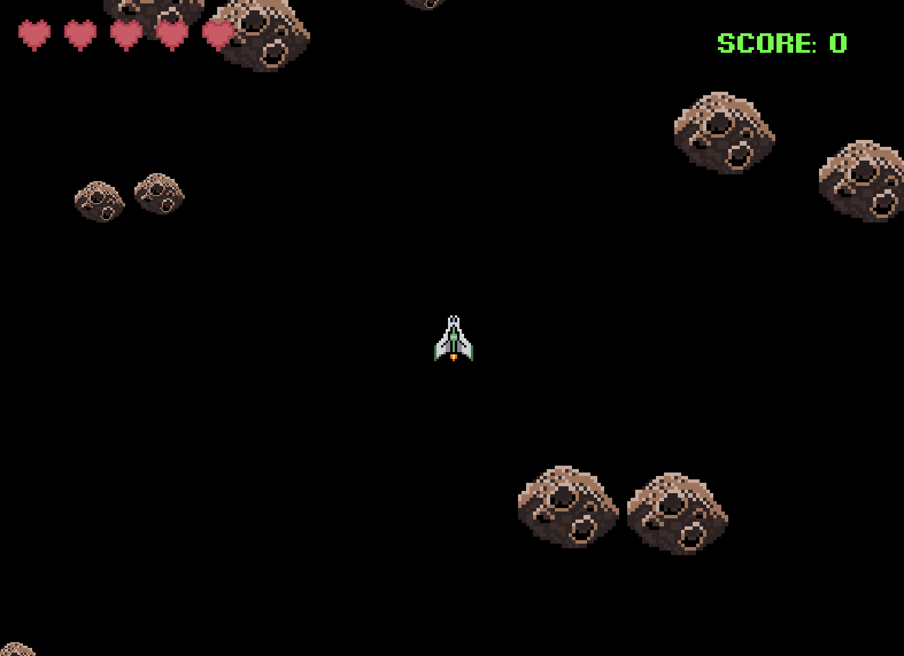

# Asteroids Game (Java)

## Overview
This is a simple Java-based version of the classic game **Asteroids**. Control your spaceship, shoot asteroids, and avoid collisions. The game features shooting mechanics, asteroid splitting, and a lives/score system.



## How to Set Up and Run the Game

### 1. Clone the Repository
Clone this repository or download the source files.

```bash
git clone <repository-link>
```
### 2. Open the Project in an IDE
Open the project in a Java-compatible IDE like IntelliJ IDEA, Eclipse, or Visual Studio Code.

### 3. Add Required Libraries
Make sure you have the following libraries included in your project:
javax.imageio.ImageIO for loading images like the heart icon for the lives counter.

### 4. Compile and Run
Compile and run the game from the main class, which contains the game loop and the main logic for the game.

### 5. Controls
Up/Down Arrow: Move the Spaceship
Left/Right Arrow: Rotate the Spaceship
Space Bar: Shoot bullets

### 6. Assets
Place any custom assets like PNG sprites (e.g., hearts, asteroids) in your data folder.

Enjoy the game!
